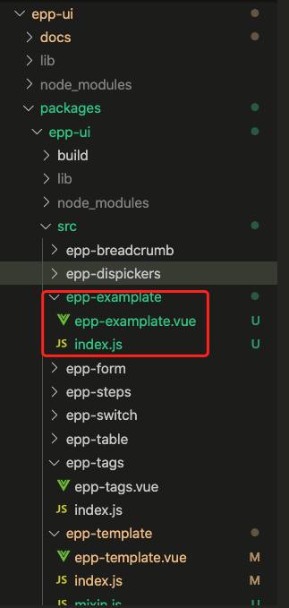

## 新建组件

1、在`packages/epp-ui/src`下新建一个组件文件夹，例如`epp-example`。

2、在`epp-examplate`中新建一个需要创造的组件,规范统一为文件夹和文件名保持一致。

3、在当前目录下新建一个`index.js`用来对外暴露组件。



`epp-examplate`代码、name是必须的保持`驼峰式`书写
```vue
<template>
  <div>测试一下
    <nb-button type="primary">测试一下的按钮</nb-button>
  </div>
</template>

<script>
export default {
  name:"eppExamplate"
}
</script>

<style>

</style>
```

<script>
export default {
  name:"eppExamplate"
}
</script>

<style>

</style>

`index.js` 代码
```javascript
import template from "./epp-examplate.vue";
// 给组件配置install方法
template.install = (Vue) => Vue.component(template.name, template);

export default template;
```

## 测试组件

1、在根目录或者在`package/example`下运行`npm run serve`。

2、在views文件夹下创建对应的页面,引入组件测试


## 编写文档

1、在根目录运行`npm run docs:dev` 运行vuepress

2、`docs/.vuepress/enhanceApp.js`中引入对应的组件地址、注意如果需要采用window，需要在Vue.mixin中引入加载
```javascript
import NbDesign from "@tencent/nb-design";
import eppTable from "../../packages/epp-ui/src/epp-table/epp-table.vue";
import eppForm from "../../packages/epp-ui/src/epp-form/epp-form.vue";
import eppSteps from "../../packages/epp-ui/src/epp-steps/epp-steps.vue";
import eppDispickers from "../../packages/epp-ui/src/epp-dispickers/epp-dispickers.vue";
import eppTags from "../../packages/epp-ui/src/epp-tags/epp-tags.vue";
import eppSwitch from "../../packages/epp-ui/src/epp-switch/epp-switch.vue";
import eppBreadcrumb from "../../packages/epp-ui/src/epp-breadcrumb/epp-breadcrumb.vue";

import DemoBlock from "./components/demo-block/demo-block.vue";
import "@tencent/nb-design/lib/theme-chalk/index.css";

export default ({
  Vue, // VuePress 正在使用的 Vue 构造函数
}) => {
  // ...做一些其他的应用级别的优化
  Vue.use(NbDesign);
  Vue.component(eppTable.name, eppTable);
  Vue.component(eppForm.name, eppForm);
  Vue.component(eppSteps.name, eppSteps);
  Vue.component(eppDispickers.name, eppDispickers);
  Vue.component(eppTags.name, eppTags);
  Vue.component(eppSwitch.name, eppSwitch);
  Vue.component("demo-block", DemoBlock);
  Vue.mixin({
    mounted(){
      Vue.component(eppBreadcrumb.name, eppBreadcrumb);
    }
  })
};

```
3、`docs/.vuepress/config.js`中配置对应的目录地址
```javascript
/*
 * @Author: your name
 * @Date: 2020-10-22 17:47:42
 * @LastEditTime: 2020-10-28 14:53:11
 * @LastEditors: Please set LastEditors
 * @Description: In User Settings Edit
 * @FilePath: /npm_epp_ui/Users/abbotwu/project/epp-ui/docs/.vuepress/config.js
 */
module.exports = (ctx) => ({
  title: "epp-ui",
  description: "一款基于管理后台的运用",
  base: "/epp-ui/",
  head: [
    [
      "link",
      {
        rel: "icon",
        href:
          "https://mvp-web-1300522992.image.myqcloud.com/img/coco_toc/favicon.ico",
      },
      //浏览器的标签栏的网页图标，第一个'/'会遍历public文件夹的文件
    ],
  ],
  themeConfig: {
    logo:
      "https://mvp-web-1300522992.image.myqcloud.com/img/coco_toc/favicon.ico",
    nav: [
      { text: "指南", link: "/guide/step" },
      { text: "组件", link: "/pages/table" },
      { text: "工具库", link: "https://ares.nb.qq.com/jsdocs/index.html" },
      {
        text: "Github",
        link: "http://git.code.oa.com/demeter_web/npm_epp_ui.git",
      },
    ],
    sidebar: {
      "/pages/": [
        {
          title: "基础组件",
          collapsable: false,
          children: [
            {
              title: "button按钮",
              collapsable: false,
              path: "button",
            },
            {
              title: "table表格",
              collapsable: false,
              path: "table",
            },
            {
              title: "form表单",
              collapsable: false,
              path: "form",
            },
            {
              title: "steps步骤条",
              collapsable: false,
              path: "steps",
            },
            {
              title: "dispickers省市区三级联动组件",
              collapsable: false,
              path: "dispickers"
            },
            {
              title: "tags标签",
              collapsable: false,
              path: "tags"
            },
            {
              title: "switch组件",
              collapsable: false,
              path: "switch"
            },
          ],
        },
        {
          title: "业务组件",
          collapsable: false,
          children: [
            {
              title: "breadcrumb面包屑",
              collapsable: false,
              path: "bread",
            },
            {
              title: "img-upload 图片上传组件",
              collapsable: false,
              path: "img-upload"
            },
            {
              title: "search-bank 选择银行/支行组件",
              collapsable: false,
              path: "search-bank"
            }
          ],
        },
      ],
      "/guide/": [
        {
          title: "起步",
          collapsable: false,
          children: [
            {
              title: "部署",
              collapsable: false,
              path: "step",
            },
            {
              title: "组件开发流程",
              collapsable: false,
              path: "dev-process",
            },
            {
              title: "B端常用网站",
              collapsable: false,
              path: "collect",
            },
          ],
        },
      ],
    },
  },
});

```
4、根据`docs/.vuepress/config.js`配的地址在对应的文件夹下创建md

5、根据<a target="_blank" href="https://www.markdown.cn/">markdown语法</a>编写文档

## 组件发布

1、<a target="_blank" href="https://iwiki.woa.com/pages/viewpage.action?pageId=113585381">tnpm注册</a>请参考iwiki文档，流程参照npm注册发布流程

2、每次发布时需要修改`package/epp-ui/.package.json`的version需要变更
```json
{
  "name": "@tencent/epp-ui",
  "version": "1.6.1",
  "private": false,
  "main": "lib/epp-ui.umd.min.js",
  "author": "abbotwu",
  "license": "MIT",
  "description": "test测试",
  "keywords": [
    "epp-ui",
    "vue"
  ],
  "files": [
    "README.md",
    "lib/*",
    "package.json",
    "src/*"
  ],
  "repository": {
    "type": "git",
    "url": "http://git.code.oa.com/demeter_web/npm_epp_ui.git"
  },
  "scripts": {
    "lib": "vue-cli-service build --target lib --name epp-ui --dest lib ./index.js",
    "lint": "vue-cli-service lint",
    "build": "vue-cli-service build"
  },
  "dependencies": {
    "@tencent/nb-design": "^0.1.1",
    "@tencent/nb-tools": "^1.0.3",
    "core-js": "^3.6.5",
    "lodash": "^4.17.20",
    "sortablejs": "^1.12.0"
  },
  "devDependencies": {
    "@vue/cli-plugin-babel": "~4.5.0",
    "@vue/cli-plugin-eslint": "~4.5.0",
    "@vue/cli-service": "~4.5.0",
    "babel-eslint": "^10.1.0",
    "eslint": "^6.7.2",
    "eslint-plugin-vue": "^6.2.2",
    "node-sass": "^4.14.1",
    "sass-loader": "^10.0.2",
    "vue": "^2.6.11",
    "vue-template-compiler": "^2.6.11"
  },
  "gitHead": "9df16b2ded9c56c46af946603d77c7a13abf6c4a"
}

```
3、在根目录下`npm run build`后再运行`npm run publish` 发布至tnpm上

4、文档跟新需要提交到`master`分支上才有效


