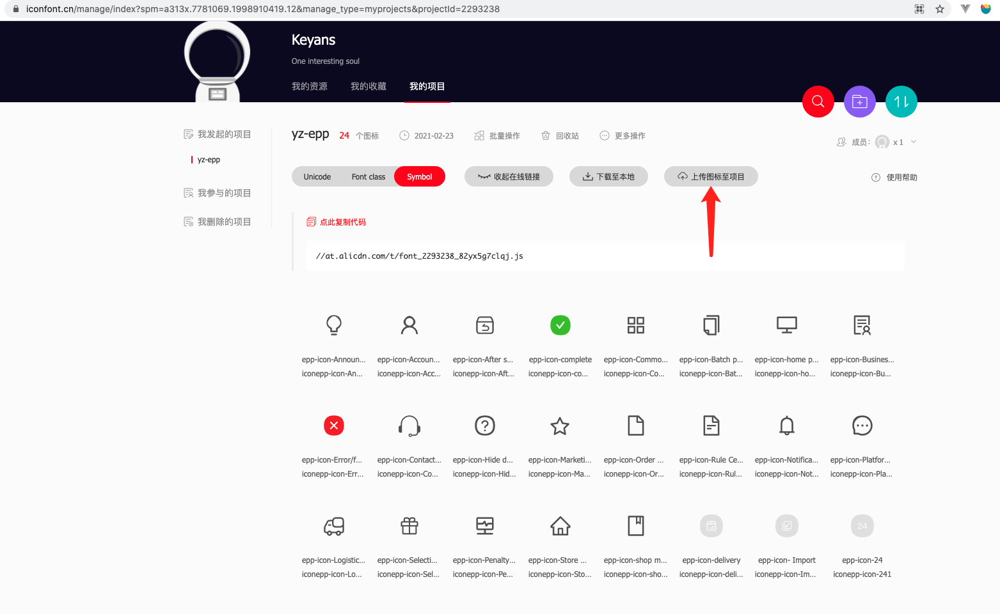
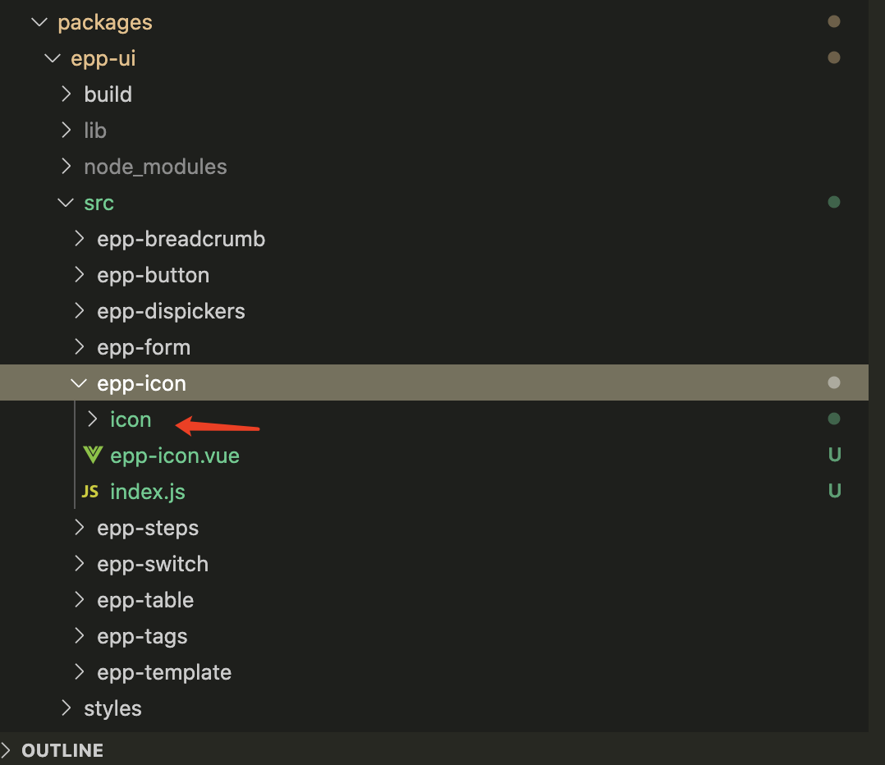

### icon图标

#### 如何上传

一、找到设计给出对应的图标

二、打开<a href="https://www.iconfont.cn/manage/index?spm=a313x.7781069.1998910419.12&manage_type=myprojects&projectId=2293238">阿里巴巴矢量图标库</a>、联系abbotwu 加入yz-epp项目。

三、打开对应的上传图标至项目中，如下图所示

四、下载至本地、解压后、存放替换当前目录，如下图所示

五、打开.vuepress中的base-icon,在文档中添加类型

#### 使用方法
直接通过设置类名为 epp-icon-iconName 来使用即可。例如：

<demo-block>
  <example-icon-demo-icon slot="source"></example-icon-demo-icon>
  <<< @/docs/.vuepress/components/example/icon/demo-icon.vue
</demo-block>

#### 图标集合

提供了一套常用的图标集合。

<demo-block>
  <example-icon-base-icon slot="source"></example-icon-base-icon>
</demo-block>