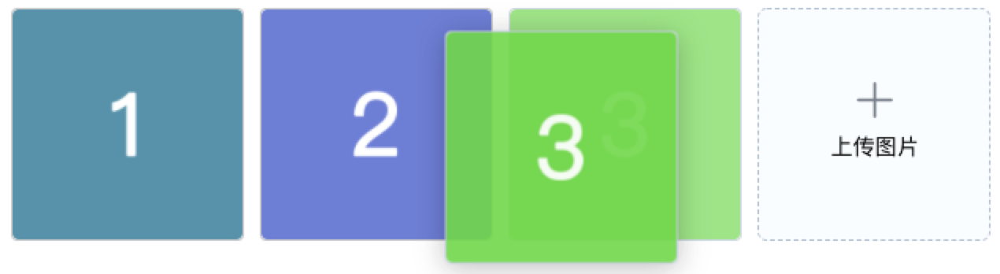

# 图片上传组件（业务组件）


## 使用说明
适用项目：商家系统  
文件地址：/src/components/epp-img-upload.vue  
GIT地址：[https://git.code.oa.com/demeter_web/coco_tob_cms/blob/master/src/components/epp-img-upload.vue](https://git.code.oa.com/demeter_web/coco_tob_cms/blob/master/src/components/epp-img-upload.vue)  
引用代码：  
```javascript
import EppImgUpload from '@/components/epp-img-upload.vue';

export default {
  components: {
    EppImgUpload,
  }
}
```
  

## 示例代码
<font color='#ff6600'>**注意：目前没有公用的图片上传接口，需要指定自己模块的图片上传接口，请勿乱用**</font>
1. 指定 <code>action</code> 属性为自己的接口地址，如 action="merchantproduct/uploadimg"
2. 与后台沟通接口协议
```
请求数据：
{
  FileName: "xxx.jpg"
}

响应数据：
{
	"FileName": "30820_1610164002457584032.jpg",
	"CosUrl": "https://mvp-1300522992.cos.ap-chengdu.myqcloud.com/product%2Ftest%2F30820_1610164002457584032.jpg?sign=q-sign-algorithm%3Dsha1%26q-ak%3DAKID7F7k7DJHYZKo1yc5HOFpAE2Zrwr7Bmrg%26q-sign-time%3D1610164002%3B1610165802%26q-key-time%3D1610164002%3B1610165802%26q-header-list%3D%26q-url-param-list%3D%26q-signature%3D9f1b95f90620e353fb81f9ad14c59dc0efc4adcf",
	"CdnUrl": "https://mvp-1300522992.image.myqcloud.com/product/test/30820_1610164002457584032.jpg"
}
```
3. 该组件会取 <code>CdnUrl</code> 字段为上传成功的图片URL地址


#### 示例：拖拽排序 & 图片限制  



<code>大版图片上传组件</code> <code>可拖拽排序</code> <code>多图上传</code> <code>最多上传10张图</code> <code>图片大小限制3M</code> <code>最大宽度1125</code> <code>最小宽度640</code> <code>图片宽高比1:1</code>
```vue
<template>
  <div> 
    <epp-img-upload
      :draggable="true"
      :multiple="true"
      :img-limit="10"
      :size-limit="3072"
      :max-width="1125"
      :min-width="640"
      :size-radio="1"
      :img-list.sync="imgList"
      action="xxx/uploadimg"
    ></epp-img-upload>
  </div> 
</template>

<script>
import EppImgUpload from '@/components/epp-img-upload.vue';

export default {
  components: {
    EppImgUpload
  },
  data() {
    return {
      imgList : []
      /*
        数据结构示例：

        初始化时数据结构（只需指定url）
        [
          { url: "https://xxxx/1.jpg" },
          { url: "https://xxxx/2.jpg" }
        ]

        上传成功时数据结构（常用的几个字段）：
        [
          {
            url: "https://xxxx/1.jpg",
            resSuccess: true,  //图片上传成功标识
            fileName: "161016246326201.jpg"  //本地图片被更换后的唯一名称
          }
        ]
      */
    }
  }
}
</script>
```


#### 示例：单张图上传

<br />


<code>大版图片上传组件</code> <code>单张上传</code> <code>最多上传1张图</code> <code>图片大小限制2M</code>

```vue
<template>
  <div> 
    <epp-img-upload
      :size-limit="2048"
      :img-list.sync="imgList"
      action="xxx/uploadimg"
    ></epp-img-upload>
  </div> 
</template>

<script>
import EppImgUpload from '@/components/epp-img-upload.vue';

export default {
  components: {
    EppImgUpload
  },
  data() {
    return {
      imgList : []
      /*
        数据结构示例：

        初始化时数据结构（只需指定url）
        [
          { url: "https://xxxx/1.jpg" },
          { url: "https://xxxx/2.jpg" }
        ]

        上传成功时数据结构（常用的几个字段）：
        [
          {
            url: "https://xxxx/1.jpg",
            resSuccess: true,  //图片上传成功标识
            fileName: "161016246326201.jpg"  //本地图片被更换后的唯一名称
          }
        ]
      */
    }
  }
}
</script>
```


#### 示例：小版图片上传组件
  
<br />


<code>小版图片上传组件</code> <code>单张上传</code> <code>最多上传1张图</code> <code>图片大小限制2M</code>

```vue
<template>
  <div> 
    <epp-img-upload
      size="mini"
      :size-limit="2048"
      :img-list.sync="imgList"
      action="xxx/uploadimg"
    ></epp-img-upload>
  </div> 
</template>

<script>
import EppImgUpload from '@/components/epp-img-upload.vue';

export default {
  components: {
    EppImgUpload
  },
  data() {
    return {
      imgList : []
      /*
        数据结构示例：

        初始化时数据结构（只需指定url）
        [
          { url: "https://xxxx/1.jpg" },
          { url: "https://xxxx/2.jpg" }
        ]

        上传成功时数据结构（常用的几个字段）：
        [
          {
            url: "https://xxxx/1.jpg",
            resSuccess: true,  //图片上传成功标识
            fileName: "161016246326201.jpg"  //本地图片被更换后的唯一名称
          }
        ]
      */
    }
  }
}
</script>
```


## 组件属性

| 参数 | 说明 | 类型 | 可选值 | 默认值 |
| ---- | ---- | ---- | ---- | ---- |
| img-list | 初始化和上传好的图片列表（双向绑定） | Array | - | [] |
| action | 上传接口地址（注意，请务必使用自己业务的上传接口） | String | - | "shoponline/uploadimg"，默认是商品管理的上传接口；注意接口地址不要带<code>/fcgi/</code> |
| size | 上传组件尺寸 | String | mini | 默认 148x148；mini版为 32x32 |
| img-limit | 上传图片数量限制 | Number | - | 1 |
| size-radio | 图片宽高比例限制，值=宽/高 | Number | - | 0，不限制 |
| size-limit | 图片k数限制（如 1024、2048、3072） | Number | - | 200 |
| max-width | 图片最大宽度限制（px） | Number | - | 0，不限制 |
| max-height | 图片最大高度限制（px） | Number | - | 0，不限制 |
| min-width | 图片最小宽度限制（px） | Number | - | 0，不限制 |
| min-height | 图片最小高度限制（px） | Number | - | 0，不限制 |
| disabled | 禁用状态 | Boolean | - | false |
| multiple | 是否支持多选图片上传 | Boolean | - | false |
| draggable | 是否支持拖拽排序已上传的图片列表 | Boolean | - | false |
| api-req-json | 接口post的额外数据 | Json对象 | - | {} | - |
| api-req-file-name-alias | 接口请求字段“文件名”的别名，默认 “FileName” | String | - | "FileName" |
| onRemove | 文件删除时的钩子 | function(removeFile, fileList)	 | - | - |
| onSuccess | 文件上传成功时的钩子 | function(successFile)	 | - | - |


