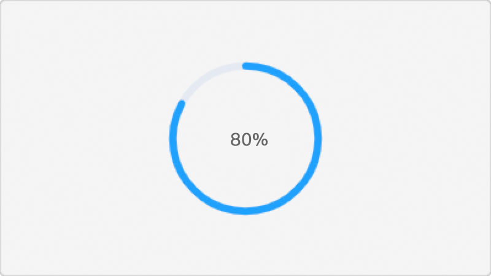

# 视频上传组件（业务组件）


## 使用说明
适用项目：商家系统  
文件地址：/src/components/epp-video-upload.vue  
GIT地址：[https://git.code.oa.com/demeter_web/coco_tob_cms/blob/master/src/components/epp-video-upload.vue](https://git.code.oa.com/demeter_web/coco_tob_cms/blob/master/src/components/epp-video-upload.vue)  
引用代码：  
```javascript
import EppVideoUpload from '@/components/epp-video-upload.vue';

export default {
  components: {
    EppVideoUpload,
  }
}
```
  

## 示例代码
<font color='#ff6600'>**注意：目前没有公用的视频上传接口，需要指定自己模块的视频上传接口，请勿乱用**</font>
1. 指定 <code>action</code> 属性为自己的接口地址，如 action="merchantproduct/uploadfile"
2. 与后台沟通接口协议
```
请求数据：
{
  FileName: "xxx.mp4"
}

响应数据：
{
	"FileName": "xxx.mp4",
	"CosUrl": "https://mvp-1300522992.cos.ap-chengdu.myqcloud.com/xxx.mp4?sign=xxx",
	"CdnUrl": "https://mvp-1300522992.image.myqcloud.com/xxx/xxx.mp4"
}
```
3. 该组件会取 <code>CdnUrl</code> 字段为上传成功的视频URL地址


#### 示例：单视频上传  

<code>初始状态</code>  

  
  

<code>上传进度</code>  

  


<code>上传成功</code>  

  


<code>可预览</code> <code>可删除</code>  
  


<code>视频大小限制10M以内</code> <code>视频展示容器宽高400*225</code> <code>最小视频时长6秒</code> <code>最大视频时长90秒</code> <code>视频宽高比1:1/4:3/16:9</code> <code>视频格式为mp4/mov</code>
```vue
<template>
  <div>
    <epp-video-upload
      :size-limit="10"
      :width="400"
      :height="225"
      :min-duration="6"
      :max-duration="90"
      :video-radio="['1:1','4:3','16:9']"
      :file-type="['mp4', 'quicktime']"
      @on-error="handleUploadError"
      @on-success="handleUploadSuccess"
      action="merchantproduct/uploadfile"
      v-model="videoList"
    />
  </div> 
</template>

<script>
import EppImgUpload from '@/components/epp-img-upload.vue';

export default {
  components: {
    EppImgUpload
  },
  data() {
    return {
      videoList : []
      /*
        数据结构示例：

        初始化时数据结构（只需指定url）
        [
          { url: "https://xxxx/1.mp4" }
        ]

        上传成功时数据结构（常用的几个字段）：
        [
          {
            url: "https://xxxx/1.mp4",
            uploadPercent: 100,  //上传进度, 100为上传成功
            fileName: "xxx.mp4"  //本地视频文件名
          }
        ]
      */
    }
  }
}
</script>
```


## 组件属性

| 参数 | 说明 | 类型 | 可选值 | 默认值 |
| ---- | ---- | ---- | ---- | ---- |
| v-model | 初始化和上传好的视频列表（双向绑定） | Array | - | [] |
| action | 上传接口地址（注意，请务必使用自己业务的上传接口）<br />注意接口地址不要带<code>/fcgi/</code>，示例"merchantproduct/uploadfile" | String | - | - |
| size-limit | 视频大小限制（MB） | Number | - | - |
| width | 视频展示宽度（px） | Number | - | 400 |
| height | 视频展示高度（px） | Number | - | 225 |
| min-duration | 视频最小时长（秒） | Number | - | 6（6秒）|
| max-duration | 视频最大时长（秒） | Number | - | 90（90秒）|
| video-radio | 视频宽高比例<br />示例：限制视频比例16:9，传入 ['16:9'] | Array | - | ['1:1', '16:9', '4:3']|
| file-type | 视频类型<br />示例：限制视频格式为mp4、quicktime，传入 ['mp4', 'quicktime'] | Array | - | ['mp4']|
| disabled | 禁用状态 | Boolean | - | false |
| api-req-json | 接口post的额外数据 | Json对象 | - | {} | - |
| api-req-file-name-alias | 接口请求字段“文件名”的别名，默认 “FileName” | String | - | "FileName" |

 
  

## 组件事件

| 事件名称 | 说明 | 回调参数 |
| ---- | ---- | ---- |
| on-error | 上传错误时触发 | (errorMsg, file) <br />errorMsg, 错误信息；file, 上传错误的文件对象 |
| on-success | 上传成功时触发 | (response, file) <br />response, 上传接口的响应数据；file, 上传成功的文件对象 |


